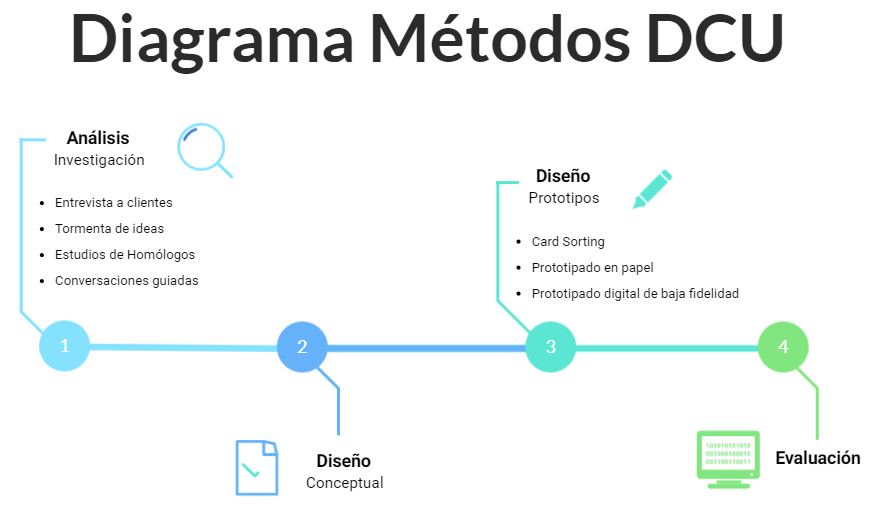

# Seminario DCU

## 1. Indica en el documento del ejemplo de aplicación del DCU, qué actividades se corresponden con el diagrama de Métodos DCU y en qué fase del diseño se ubica.

## 2. Aplicar el DCU para la realización de un prototipo de una aplicación web para la gestión y optimización del tiempo de estudio de un estudiante del Grado en Ingeniería Informática de la ULL. 

### Definir las tareas que se llevarán a cabo en la fase de investigación y diseño conceptual de la aplicación.

En la **fase de análisis** hemos llevado a cabo una **encuesta** y una **entrevista** a ponteciales usuarios de la aplicación web con el objetivo de recabar información para el desarrollo de la misma. A continuación, hemos hecho un estudio de los datos obtenidos en ambos **métodos de investigación**. 

En la **fase de diseño conceptual** hemos realizado los perfiles de usuario a partir de la información recopilada y los personajes con el objetivo de modelar a los usuarios de nuestra aplicación.

**Encuesta a usuarios**

En este momento, se muestra las conclusiones obtenidas a partir del estudio producido.

