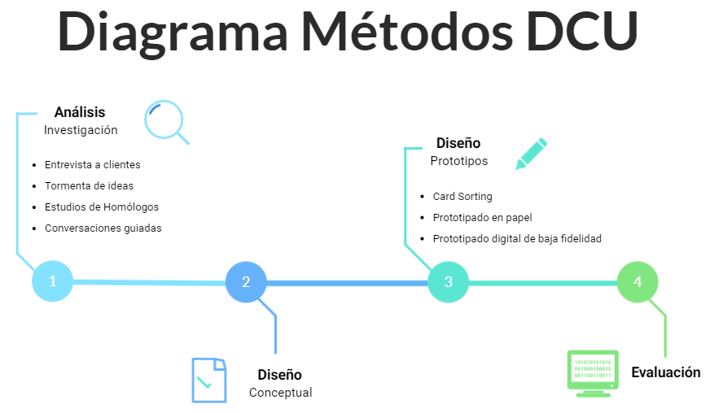
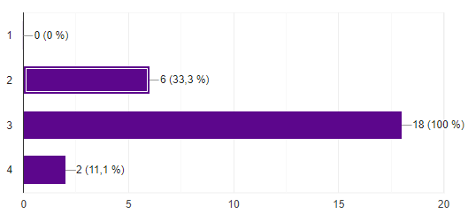
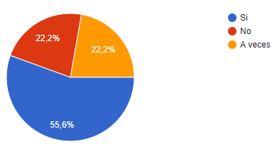
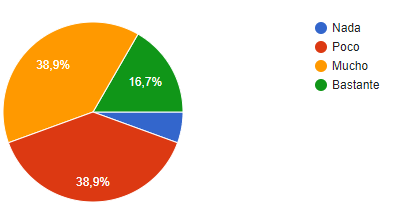

# Seminario DCU

## 1. Indica en el documento del ejemplo de aplicación del DCU, qué actividades se corresponden con el diagrama de Métodos DCU y en qué fase del diseño se ubica.

## 2. Aplicar el DCU para la realización de un prototipo de una aplicación web para la gestión y optimización del tiempo de estudio de un estudiante del Grado en Ingeniería Informática de la ULL. 

### Definir las tareas que se llevarán a cabo en la fase de investigación y diseño conceptual de la aplicación.

En la **fase de análisis** hemos llevado a cabo una [encuesta](https://forms.gle/gumy9CuDWVTNcYJ6A) y una [entrevista](https://forms.gle/C5hDC73zFMZ4rwrm9) a ponteciales usuarios de la aplicación web con el objetivo de recabar información para el desarrollo de la misma. La encuesta fue completada por 18 personas y a la entrevista respondieron 16. A continuación, hemos hecho un estudio de los datos obtenidos en ambos **métodos de investigación**. 

En la **fase de diseño conceptual** hemos realizado los perfiles de usuario a partir de la información recopilada y los personajes con el objetivo de modelar a los usuarios de nuestra aplicación.

En este momento, se muestra las conclusiones obtenidas a partir del estudio realizado.

**Encuesta a usuarios**

En primer lugar, podemos observar que la mayoría de los usuarios encuestados son de género masculino (72,2 % hombres y 27,8 % mujeres), esto es debido a que la mayoría de alumnos del Grado de Ingeniería Informática son hombres. 

Por otro lado, en el rango de edad destacamos que existe un gran porcentaje (72,2%) de usuarios entre 18 y 20 años. 

En cuanto al curso universitario se observa que la totalidad de los encuestados cursan asignaturas de 3º curso y entre ellos el 44,4 % de usuarios también tienen asignaturas de otros cursos.

Considerando el tiempo de estudio la encuesta refleja que el 72,2 % de los alumnos del Grado dedican entre 1 y 2 horas de media al día. 

Analizando los datos obtenidos, existe un problema en cuanto a la organización del tiempo de estudio del alumnado ya que el 72,3 % consideran que se distraen mucho o bastante, además el 61,1 % no siguen un horario a la hora de estudiar y un relevante 44,4 % creen que su gestión del tiempo no es adecuada. Estos porcentajes muestran que nuestra aplicación es realmente necesaria porque permitirá resolver los problemas a los que se enfrentan los estudiantes.

Podemos ver como existe un 22,2% de estudiantes que no organizan el tiempo que le van a dedicar a cada asignatura y consideran que sus notas no se corresponden con el tiempo dedicado. Aquí podemos decir que gestionar el tiempo de estudio es clave ya que puedes saber cuántas horas le habrás dedicado y qué tan bien irás preparado para el examen como para saber si tu nota estará entre las mejores o las peores en comparación a las demás asignaturas. Nuestra aplicación deberá lograr esto último, gestionar tu tiempo para que tú mismo puedas saber en qué nivel te encuentras en cada asignatura. Cabe destacar que no solo servirá para aquellos estudiantes que no organizan su tiempo, sino que también irá para los estudiantes que sí lo hacen pero no de una manera adecuada y obtienen unas notas que no se corresponden con lo que han dedicado.

Destacamos también entre los usuarios encuestados que existe la misma cantidad de personas que no tienen tiempo para estudiar fuera del horario lectivo como los que sí lo tienen. Por ello, en nuestra aplicación web, tendremos que tener en cuenta a aquellos usuarios que tienen distinta disponibilidad entre horas para su estudio y de esta forma, conseguir optimizar el tiempo de la mejor manera posible según las necesidades de los mismos.

Entre los elementos con los que más se distraen los alumnos se encuentran el móvil, redes sociales y videojuegos. Como se puede observar, la mayor distracción que tiene un usuario gira entorno al dispositivo móvil y dado que la mayoría de los mismos encuentran útil añadir una funcionalidad que limite el uso del dispositivo, consideramos necesario incluir dicha herramienta en nuestra aplicación web.

Los resultados de la encuesta revelan que la mayoría de los usuarios desean tener una aplicación web para gestionar el tiempo de estudio porque tan sólo el 5,6 % no estarían dispuesto a visitarla, y el 77,8 % les gustaría disponer de una herramienta de este tipo. Además, es necesario que se pueda incluir todos los eventos del aula virtual en la propia aplicación porque la totalidad de los usuarios quieren disponer de esta funcionalidad. También debemos tener en cuenta el ordenador cuando desarrollemos nuestra aplicación debido a que el conjunto de los encuestados utilizan fundamentalmente este dispositivo para estudiar.

Los usuarios encuestados han ordenado las funcionalidades que les hemos propuesto de la siguiente forma:

1. Recibir notificaciones sobre eventos próximos.
2. La aplicación web priorice las tareas de acuerdo a su importancia en la nota final y tiempo de entrega.
3. Incluir descansos en el horario.
4. Comparar la propia planificación del tiempo de estudio con la de otros usuarios.

En general las normas de privacidad de este tipo de aplicaciones no constituyen una preocupación para las personas porque el 88,9% de ellas consideran que no se infringen dichas normas. Dado que la aplicación no representa ningún problema de privacidad, todos los usuarios estarían dispuestos a ser sinceros con respecto al tiempo dedicado al estudio.

Finalmente, las aplicaciones para la gestión del tiempo de estudio más utilizadas por los estudiantes son: Focus To-Do, Forest, School Planner y any.do.

**Entrevista**

En la entrevista preguntamos acerca del nombre, género, edad y curso de la persona para conocer al usuario y por otra parte, nos enfocamos en las preguntas relacionadas con la aplicación web.

A continuación se muestran las preguntas que hemos realizado y sus correspondientes respuestas:

**¿Qué factores tienes más en cuenta cuando gestionas tu tiempo de estudio? (Ejemplos: fechas, dificultad de la asignatura...)**

* Dificultad del examen o de la tarea a realizar, también se tiene en cuenta la complejidad de la asignatura.
* Fecha de entrega de los trabajos o del examen. 
* Tiempo que se necesita para realizar la tarea o estudiar para el examen.
* Prioridad respecto a otras asignaturas. 
* Tiempo disponible para llevar a cabo el trabajo. 

**¿Qué funcionalidades crees que debe tener una aplicación para gestionar el tiempo de estudio?**

* Calendario (se incluyen exámenes) y horario.
* Programar actividades y prioridad entre ellas.
* Recordatorios (notificaciones sobre retrasos, horas de estudio, fechas próximas, las tareas a las que se dedica menos tiempo ...).
* Organizar actividades por asignaturas para controlar la carga de trabajo de cada una de ellas.
* Gestión de los tiempos de descanso y de estudio (para no sobrepasar un tiempo diario).
* Bloqueo de aplicaciones del móvil para evitar distracciones.
* Gráfico de horas empleadas por asignaturas.
* Seguimiento y comparación del tiempo empleado frente al que se debería emplear.
* Apartado que indiquen los objetivos.
* Permitir escoger tanto la forma de trabajo, como el horario de estudio y los descansos.
* Sugerencia de planificaciones.
* Gestionar la distribución de horas a cada asignatura.

**¿Qué cosas utilizas para gestionar tu tiempo de estudio?**

* Google Calendar. Es una agenda y calendario electrónico.
* Google Keep. Permite organizar la información personal a través de notas.
* Notion. Aplicación para organizar cada semana, programar entregas de las asignaturas y si se han terminado antes de tiempo.
* Método pomodoro. Herramienta de gestión y organización del tiempo que dedicamos a cada tarea, bien sea a lo largo de la jornada laboral o durante el tiempo que dedicamos al estudio.
* Lista sin prioridad para visualizar la cantidad de trabajos.
* Lista con prioridad para establecer un orden en las tareas.
Agenda.
* School Planner. Aplicación que permite anotar tareas, exámenes y recordatorios.

**¿Qué información estarías dispuesto a proporcionar a la aplicación para conseguir que esta gestione el tiempo? (Ejemplos: tiempo disponible para estudiar, horario de clase…)**

* Tiempo diario disponible para estudiar.
* Horario lectivo.
* Eventos que el usuario tenga en su calendario.
* Cantidad de horas que son necesarias para estudiar una asignatura.
* Tiempo dedicado al ocio, deportes, trabajo, descanso...
* Dificultad de los exámenes y tareas. 
* Toda la información que sea necesaria siempre y cuando se realice un tratamiento anónimo de los datos.
* Tareas que están pendientes de realizar.
* Correo electrónico para recibir notificaciones.
* Fechas de los exámenes y tareas.

**¿Qué acciones permitirías realizar a la aplicación sobre tus dispositivos para lograr que gestione tu tiempo de estudio? (Ejemplos: recibir notificaciones, control de uso de las aplicaciones…)**

* Recibir notificaciones. 
* Control de uso de aplicaciones indicadas por el usuario (bloqueo de aplicaciones).
* Acceso a Google Calendar.
* Control del móvil sin acceso a datos personales.

